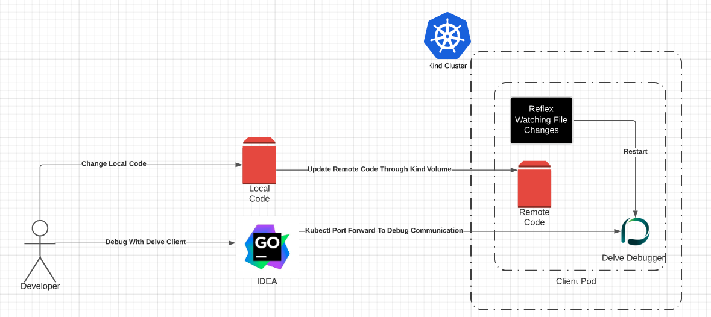
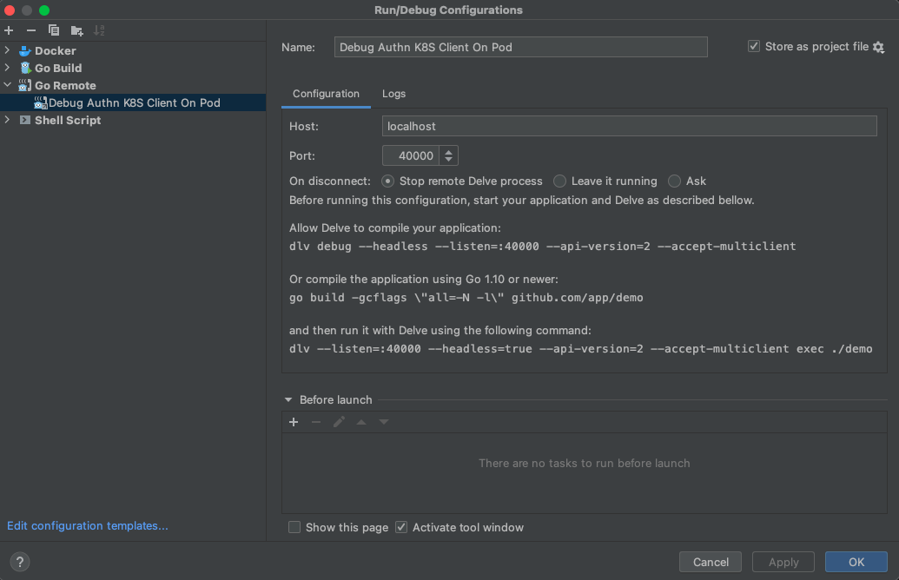

# Contributing

Thanks for your interest in contributing to the Conjur authn-k8s client! In
this document you'll find guidelines for how to get started.

For general contribution and community guidelines, please see the [community repo](https://github.com/cyberark/community).

## Table of Contents

[Contributing](#contributing)

* [Table of Contents](#table-of-contents)
* [Development](#development)
  + [Prerequisites](#prerequisites)
  + [Debug Using Delve](#debug-using-delve)
* [Testing](#testing)
  + [Test Suites](#test-suites)
  + [Demo Workflow](#demo-workflow)
* [Releases](#releases)
  + [Update the version, changelog, and notices](#update-the-version--changelog--and-notices)
  + [Add a git tag](#add-a-git-tag)
  + [Publish the git release](#publish-the-git-release)
  + [Publish the Red Hat image](#publish-the-red-hat-image)
* [Contributing](#contributing-1)

## Development

### Prerequisites

- To work in this codebase, you will want to have at least Go v1.13 installed. The
  code may work on older versions but it has not been tested nor evaluated to be
  compatible for those configurations. We expect at the very least that you will
  need Go modules support so you will at minimum need Go v1.11+.

### Debug Using Delve



For development purposes you may want to debug your code on K8S pod. There are the steps to do it:

1. Make sure `delve` installed
   `brew install delve`

1. Make sure `kind` installed on your environment
   
   ```bash
   curl -Lo ./kind https://kind.sigs.k8s.io/dl/v0.11.1/kind-linux-amd64
   chmod +x ./kind
   mv ./kind /usr/local/bin/kind
   ```
   
2. Make sure you have `kubectl`
   
   ```bash
   curl -LO "https://dl.k8s.io/release/$(curl -L -s https://dl.k8s.io/release/stable.txt)/bin/linux/amd64/kubectl"
   sudo install -o root -g root -m 0755 kubectl /usr/local/bin/kubectl
   ```
   
2. Create kind cluster
   `kind create cluster --config dev/kind.yaml`

2. Build docker image for debugging with the `Dockerfile.Debug` running:
   `docker build -f dev/Dockerfile.debug -t authn-k8s-client-debug:latest .`

2. Load the docker image to your kind cluster
   `kind load docker-image authn-k8s-client-debug:latest`

7. Create and run a deployment with authn-k8s-client-debug:latest and your configuration. In your deployment please note these things (you may use this example)

   1. Port for debugger (In my example it's 40000)

   2. volumeMounts and volumes to enable your local files be transferred to the container

   3. Your environment variables for the authn-k8s-client

      

   ```yaml
   ---
   apiVersion: apps/v1
   kind: Deployment
   metadata:
     labels:
       app: debug-conjur-authn-k8s-client
     name: debug-conjur-authn-k8s-client
   spec:
     replicas: 1
     selector:
       matchLabels:
         app: debug-conjur-authn-k8s-client
     template:
       metadata:
         labels:
           app: debug-conjur-authn-k8s-client
       spec:
         containers:
           - image: authn-k8s-client-debug
             imagePullPolicy: Never
             name: debug-authn-k8s-client
             env:
               <YOUR ENV VARIABLES>
             ports:
               - containerPort: 40000 # Debugger port
             volumeMounts:
             - mountPath: /run/conjur
               name: conjur-access-token
             - mountPath: /work
               name: test-volume # Path in the container
         imagePullSecrets:
           - name: dockerpullsecret
         volumes:
           - name: conjur-access-token
             emptyDir:
               medium: Memory
           - name: test-volume
             hostPath:
               path: /src/authn-k8s-client # For Kind Volume
   ```

8. Create port forwarding to the debug port in your deployment (in this example it's 40000)
   `kubectl port-forward deployment/debug-conjur-authn-k8s-client 40000:40000`

9. Now you can use your favorite GO IDE to configure remote debug configuration for the port you chosen and debug on your local pod. 

   * In GoLand you can create a `Go Remote` running configuration and use it to connect to delve with the local port and 
     debug like any other program but now on your pod. There is a debug configuration for GoLand in this repo called `Debug_Authn_K8S_Client_On_Pod.xml`
     

Clean your env with:

`kind delete cluster`

For more reading about whats done here you can read this [documentation](https://github.com/doodlesbykumbi/dev-in-k8s)

## Testing

### Test Suites

To run the test suite, run `./bin/build` and `./bin/test`.

### Demo Workflow 

To run a sample deployment of the Helm charts located in `/helm`, run `./bin/test-workflow/start`. This
will download and run the `conjur-oss-helm-chart` project example, then consecutively install the 
`helm/conjur-config-cluster-prep`, `helm/conjur-config-namespace-prep`, and `helm/conjur-app-deploy` charts, in that order.

#### Demo Workflow JWT

You can create demo cluster of to check JWT sidecars on K8S. Please be aware this is now only for local kind cluster and not part of the pipeline because it requires open of K8S API for unauthenticated users. These are three options to run it.

1. Test conjur-authn-k8s-client as sidecar container:

   `./bin/test-workflow/start  -a summon-sidecar-jwt --jwt` 

2. Test secrets provider as init container:

   `./bin/test-workflow/start  -a secrets-provider-k8s-jwt --jwt`
   
3. Test secretless broker as sidecar container:  
   `./bin/test-workflow/start  -a secretless-broker --jwt`

Flags explanation :

* -n Can be added for remaing the environment after script finished
* -a Is for stating the app flow name
* --jwt To enable jwt needed configurations to the cluster:
  * Install K8S ca in Conjur so it will be able to fetch jwks from K8S API
  * Open K8S JWKS API for unauthenticated user

You can use the kubectl edit command to edit the images in the deployment and replacing them with you develop and debug images for development porpuses. And fill free to play with the policy and the application K8S manifests to check convinently things on the sidecars.

## Releases

Releases should be created by maintainers only. To create and promote a
release, follow the instructions in this section.

### Update the changelog and notices
1. Create a new branch for the version bump.
1. Based on the changelog content, determine the new version number and update.
1. Determine the new version number and update the Helm `Chart.yaml` files in the `helm/conjur-*/` directories.
1. Review the git log and ensure the [changelog](CHANGELOG.md) contains all
   relevant recent changes with references to GitHub issues or PRs, if possible.
1. Review the changes since the last tag, and if the dependencies have changed
   revise the [NOTICES](NOTICES.txt) to correctly capture the included
   dependencies and their licenses / copyrights.
1. Commit these changes - `Bump version to x.y.z` is an acceptable commit
   message - and open a PR for review.

### Release and Promote
1. Merging into main/master branches will automatically trigger a release. If successful, this release can be promoted at a later time.
1. Jenkins build parameters can be utilized to promote a successful release or manually trigger aditional releases as needed.
1. Reference the [internal automated release doc](https://github.com/conjurinc/docs/blob/master/reference/infrastructure/automated_releases.md#release-and-promotion-process) for releasing and promoting.
### Publish the Red Hat image
1. Visit the [Red Hat project page](https://connect.redhat.com/project/795581/view) once the images have
   been pushed and manually choose to publish the latest release.

## Contributing

1. [Fork the project](https://help.github.com/en/github/getting-started-with-github/fork-a-repo)
2. [Clone your fork](https://help.github.com/en/github/creating-cloning-and-archiving-repositories/cloning-a-repository)
3. Make local changes to your fork by editing files
3. [Commit your changes](https://help.github.com/en/github/managing-files-in-a-repository/adding-a-file-to-a-repository-using-the-command-line)
4. [Push your local changes to the remote server](https://help.github.com/en/github/using-git/pushing-commits-to-a-remote-repository)
5. [Create new Pull Request](https://help.github.com/en/github/collaborating-with-issues-and-pull-requests/creating-a-pull-request-from-a-fork)

From here your pull request will be reviewed and once you've responded to all
feedback it will be merged into the project. Congratulations, you're a
contributor!
